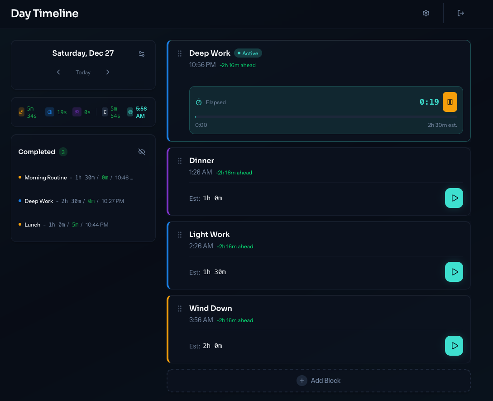
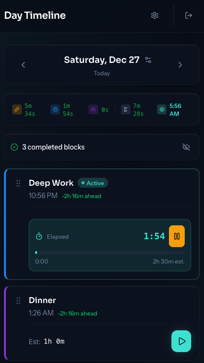

# Day Timeline

A block-based daily timeline with planned vs actual tracking.

A small, personal web app to help you have better days without rigid schedules or productivity theatre. Plan your day in rough blocks, track what actually happens, and let the timeline adapt as the day unfolds.

## What it is

- A **daily timeline**, not a calendar
- Based on **blocks** (e.g. Wake, Deep Work, Food, Wind-down)
- Each block has:
  - an estimated duration
  - actual time tracked via start/stop
- Shows **planned vs actual**, including how your day drifts
- Designed for night owls and non-linear days

## What it is not

- Not a productivity app
- Not a task manager
- Not a habit tracker
- Not optimised for teams or collaboration

This is a tool for running *one* day at a time.

## Features

- **"I'm Awake" button** - Start your day with a single tap
- **Flexible blocks** - Reorder, duplicate, or adjust estimates as needed
- **Time tracking** - Start/stop per block, with multiple sessions supported
- **Planned vs actual** - See how your estimates compare to reality
- **Ahead/behind indicator** - Know if you're running early or late
- **Bedtime forecast** - See when you'll finish based on remaining blocks
- **Category breakdown** - Track time across work, routine, leisure, etc.
- **Cross-device sync** - Changes sync in real-time across all your devices
- **Touch-friendly** - Works great on mobile and tablet with swipe gestures

## Screenshots

<table>
  <tr>
    <td></td>
    <td></td>
  </tr>
</table>

## Self-Hosting

Day Timeline is self-hosted using AWS Amplify. You'll need:

- Node.js 20+
- An AWS account

To deploy your own instance, see the [Development Guide](docs/dev.md) for setup instructions.

## Status

This is an early MVP built for personal use. It works, but it's intentionally minimal and will evolve slowly.

## License

MIT © Sean McNamara

Use it however you like. If it helps you have better days, that's a win.
